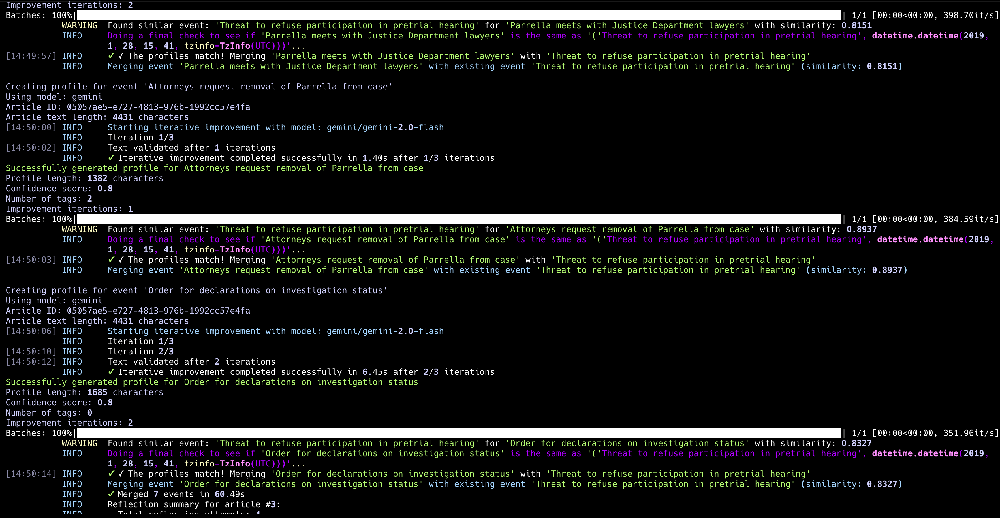
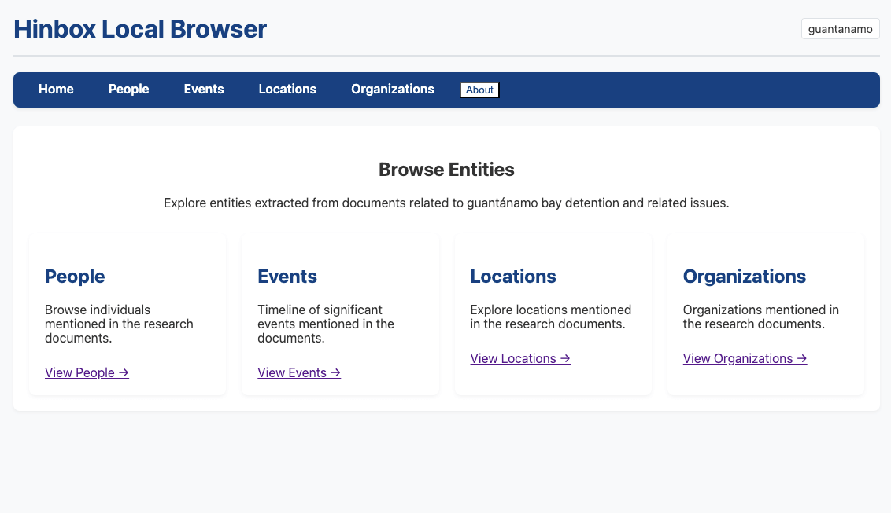
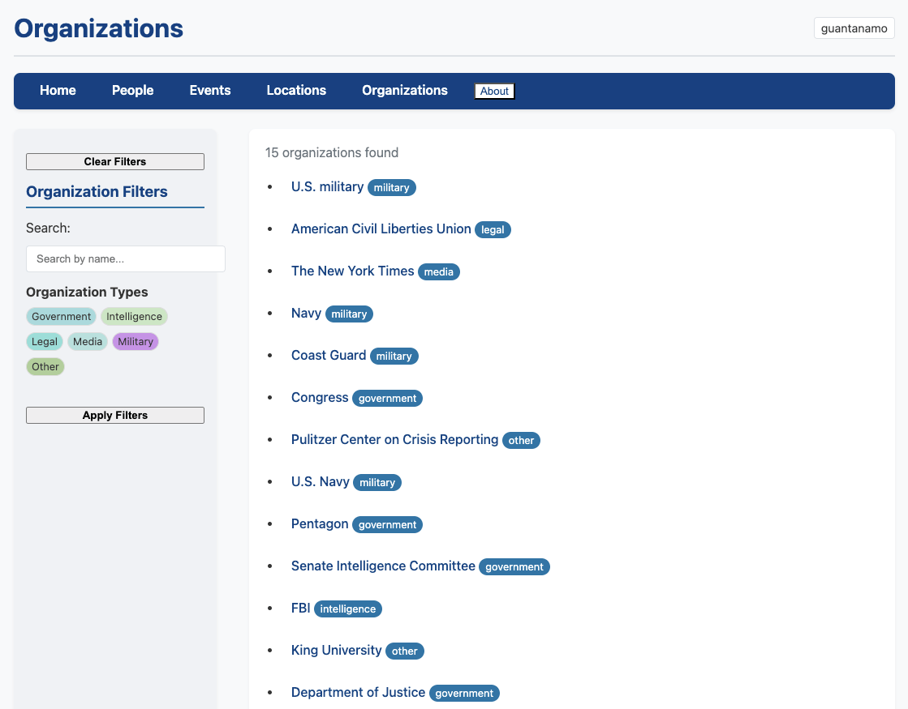
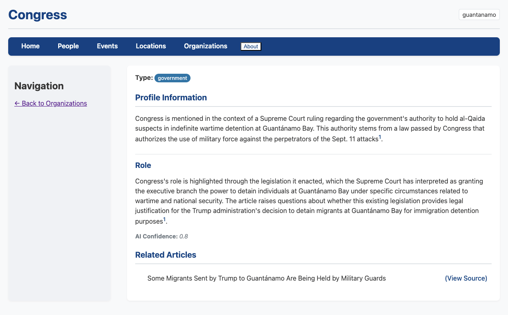

# hinbox

`hinbox` is a flexible, domain-configurable entity extraction system designed
for historians and researchers. It processes historical documents, academic
papers, news articles, and book chapters to extract structured information about
people, organizations, locations, and events. Originally designed for Guantánamo
Bay media coverage analysis, it now supports any historical or research domain
through a simple configuration system.

## 🎯 Key Features

- **Research-Focused**: Designed for historians, academics, and researchers
- **Flexible Sources**: Process historical documents, academic papers, news articles, book chapters
- **Domain-Agnostic**: Configure for any historical period, region, or research topic
- **Multiple AI Models**: Support for both cloud (Gemini default, but supports
  anything that `litellm` supports) and local (Ollama default, but works with
  `litellm`) models  
- **Entity Extraction**: Automatically extract people, organizations, locations, and events
- **Smart Deduplication**: Uses embeddings to merge similar entities across sources
- **Profile Versioning**: Track how entity profiles evolve as new sources are processed
- **Modular Engine**: `src/engine` coordinates article processing, extraction, merging, and profile versioning so new domains can reuse the same pipeline
- **Web Interface**: FastHTML-based UI for exploring research findings with version navigation
- **Easy Setup**: Simple configuration files, no Python coding required

## 📸 Screenshots

<figure>
  
  <figcaption><em>Real-time processing logs showing entity extraction progress with detailed status updates</em></figcaption>
</figure>

<figure>
  
  <figcaption><em>Main dashboard displaying research domains and extracted entity statistics</em></figcaption>
</figure>

<figure>
  
  <figcaption><em>Organizations listing with search and filtering capabilities for research analysis</em></figcaption>
</figure>

<figure>
  
  <figcaption><em>Detailed organization profile showing extracted information, sources, and version history</em></figcaption>
</figure>

## 🚀 Quick Start

> **Note**: This project supports both `./run.py` commands and `just` commands. Use whichever you prefer!

### 1. List Available Domains
```bash
./run.py domains
# OR: just domains
```

### 2. Create a New Research Domain
```bash
./run.py init palestine_food_history
# OR: just init afghanistan_1980s
```

### 3. Configure Your Research Domain
Edit the generated files in `configs/palestine_food_history/`:
- `config.yaml` - Research domain settings and data paths
- `prompts/*.md` - Extraction instructions tailored to your sources
- `categories/*.yaml` - Entity type definitions relevant to your research

### 4. Process Your Sources
```bash
./run.py process --domain palestine_food_history --limit 5
# OR: just process-domain afghanistan_1980s --limit 5
```

### 5. Explore Results
```bash
./run.py frontend
# OR: just frontend
```

## 📦 Installation

### Prerequisites
- Python 3.12+
- `uv` (for dependency management)
- Optional: Ollama (for local model support)
- Optional: just (for easier command running)

### Setup

1. **Clone the repository:**
   ```bash
   git clone https://github.com/strickvl/hinbox.git
   cd hinbox
   ```

2. **Install dependencies:**
   ```bash
   uv sync
   ```

3. **Set up environment variables:**
   ```bash
   export GEMINI_API_KEY="your-gemini-api-key"
   # Optional for local processing:
   export OLLAMA_API_URL="http://localhost:11434/v1"
   ```

4. **Verify installation:**
   ```bash
   ./run.py domains
   ```

## 📚 Research Domain Examples

### History of Food in Palestine
```bash
just init palestine_food_history
# Edit configs/palestine_food_history/ to focus on:
# - People: farmers, traders, cookbook authors, anthropologists
# - Organizations: agricultural cooperatives, food companies, research institutions
# - Events: harvests, famines, recipe documentation, cultural exchanges
# - Locations: villages, markets, agricultural regions, refugee camps
```

### Soviet-Afghan War (1980s)
```bash
just init afghanistan_1980s
# Configure for:
# - People: military leaders, diplomats, journalists, mujahideen commanders
# - Organizations: military units, intelligence agencies, NGOs, tribal groups
# - Events: battles, negotiations, refugee movements, arms shipments
# - Locations: provinces, military bases, refugee camps, border crossings
```

### Medieval Trade Networks
```bash
just init medieval_trade
# Set up for:
# - People: merchants, rulers, scholars, travelers
# - Organizations: trading companies, guilds, monasteries, courts
# - Events: trade agreements, diplomatic missions, market fairs
# - Locations: trading posts, cities, trade routes, ports
```

## 🛠 Advanced Usage

### Processing Historical Sources
```bash
# Process with different options
./run.py process --domain afghanistan_1980s -n 20 --verbose
just process-domain palestine_food_history --limit 10 --relevance

# Use local models (requires Ollama) - useful for sensitive historical research
./run.py process --domain medieval_trade --local

# Force reprocessing when you update your configuration
./run.py process --domain afghanistan_1980s --force
```

### Web Interface
```bash
./run.py frontend
# OR: just frontend
```
Explore extracted entities at http://localhost:5001

### Data Management
```bash
# Check processing status
./run.py check

# Reset processing status
./run.py reset

# View available domains
./run.py domains
```

## 📂 Project Structure

```
configs/
├── guantanamo/        # Example domain shipped with the project
├── template/          # Starter files copied by `run.py init`
└── README.md          # Domain configuration walkthrough

src/
├── process_and_extract.py  # CLI entry point for the article pipeline
├── engine/                 # ArticleProcessor, EntityExtractor, mergers, profiles
├── frontend/               # FastHTML UI (routes, components, static assets)
├── utils/                  # Embeddings, LLM wrappers, logging, file helpers
├── config_loader.py        # Domain configuration loader helpers
├── dynamic_models.py       # Domain-driven Pydantic model factories
├── constants.py            # Model defaults, embedding settings, thresholds
└── exceptions.py           # Custom exception types used across the pipeline

tests/
├── embeddings/                     # Embedding manager and similarity unit tests
├── test_domain_paths.py            # Validates domain-specific path resolution
├── test_entity_merger_merge_smoke.py   # Embedding-based merge smoke tests
├── test_entity_merger_similarity.py    # Similarity scoring behaviour
├── test_profile_versioning.py          # Versioned profile regression tests
└── test_frontend_versioning.py         # UI behaviour for profile history

data/
├── guantanamo/        # Default domain data directory (created locally)
└── {domain}/          # Additional domains maintain their own raw/entity data
```

## 🔧 Configuration

### Domain Configuration
Each domain has its own `configs/{domain}/` directory with:

**config.yaml** - Main settings:
```yaml
domain: "palestine_food_history"
description: "Historical analysis of Palestinian food culture and agriculture"
data_sources:
  default_path: "data/palestine_food_history/raw_sources/historical_sources.parquet"
output:
  directory: "data/palestine_food_history/entities"
```

**categories/*.yaml** - Entity type definitions:
```yaml
person_types:
  player:
    description: "Professional football players"
    examples: ["Lionel Messi", "Cristiano Ronaldo"]
```

**prompts/*.md** - Extraction instructions (plain English!):
```markdown
You are an expert at extracting people from historical documents about Palestinian food culture.
Focus on farmers, traders, cookbook authors, researchers, and community leaders...
```

### Data Format
Historical sources should be in Parquet format with columns:
- `title`: Document/article title
- `content`: Full text content  
- `url`: Source URL (if applicable)
- `published_date`: Publication/creation date
- `source_type`: "book_chapter", "journal_article", "news_article", "archival_document", etc.

## 🏗 Architecture

### Processing Pipeline
1. **Configuration Loading**: Read domain-specific settings
2. **Source Loading**: Process historical documents in Parquet format
3. **Relevance Filtering**: Domain-specific content filtering for research focus
4. **Entity Extraction**: Extract people, organizations, locations, events from historical sources
5. **Smart Deduplication**: Merge similar entities using embeddings
6. **Profile Generation**: Create comprehensive entity profiles with automatic versioning
7. **Version Management**: Track profile evolution as new sources are processed

### Engine Modules
- `ArticleProcessor` orchestrates relevance checks, extraction dispatch, and per-article metadata aggregation (`src/engine/article_processor.py`)
- `EntityExtractor` unifies cloud and local model calls using domain-specific Pydantic schemas (`src/engine/extractors.py`)
- `EntityMerger` compares embeddings, calls match-checkers, and updates persisted Parquet rows (`src/engine/mergers.py`)
- `VersionedProfile` and helper functions maintain profile history for each entity (`src/engine/profiles.py`)

### Key Features
- **Domain-Agnostic**: Easy to configure for any topic
- **Multiple AI Models**: Cloud (Gemini) and local (Ollama) support
- **Smart Processing**: Automatic relevance filtering and deduplication
- **Profile Versioning**: Track entity profile changes over time with full version history
- **Modern Interface**: FastHTML-based web UI with version navigation
- **Robust Pipeline**: Error handling and progress tracking

## Development

### Testing
```bash
# Run tests (pytest)
pytest tests/

# Run specific test files
pytest tests/test_profile_versioning.py
pytest tests/test_frontend_versioning.py
```

The project includes unit tests for profile versioning functionality and frontend components.

### Code Quality
```bash
# Format code
./scripts/format.sh

# Run linting
./scripts/lint.sh

# Both together
just check-code
```

## 🤝 Contributing

Contributions welcome! Areas of interest:
- New domain templates and examples
- Additional language model integrations
- Enhanced web interface features
- Performance optimizations

## 📄 License

MIT License - see [LICENSE](LICENSE) file for details.

## 🙋 Support

For questions about:
- **Configuration**: See `configs/README.md`
- **Setup**: Check installation steps above
- **Usage**: Try `./run.py --help` or `just --list`
- **Issues**: Open a GitHub issue

---

**Built for**: Historians, researchers, and academics working with large document collections

**Built with**: Python, Pydantic, FastHTML, LiteLLM, Jina Embeddings
