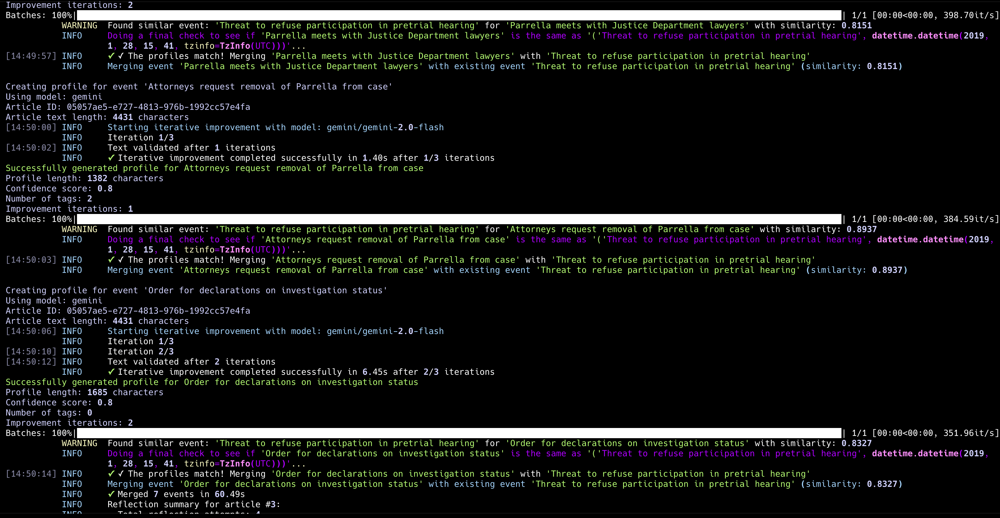
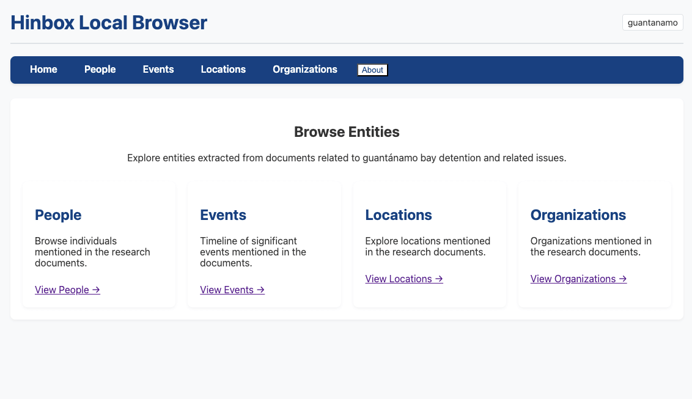
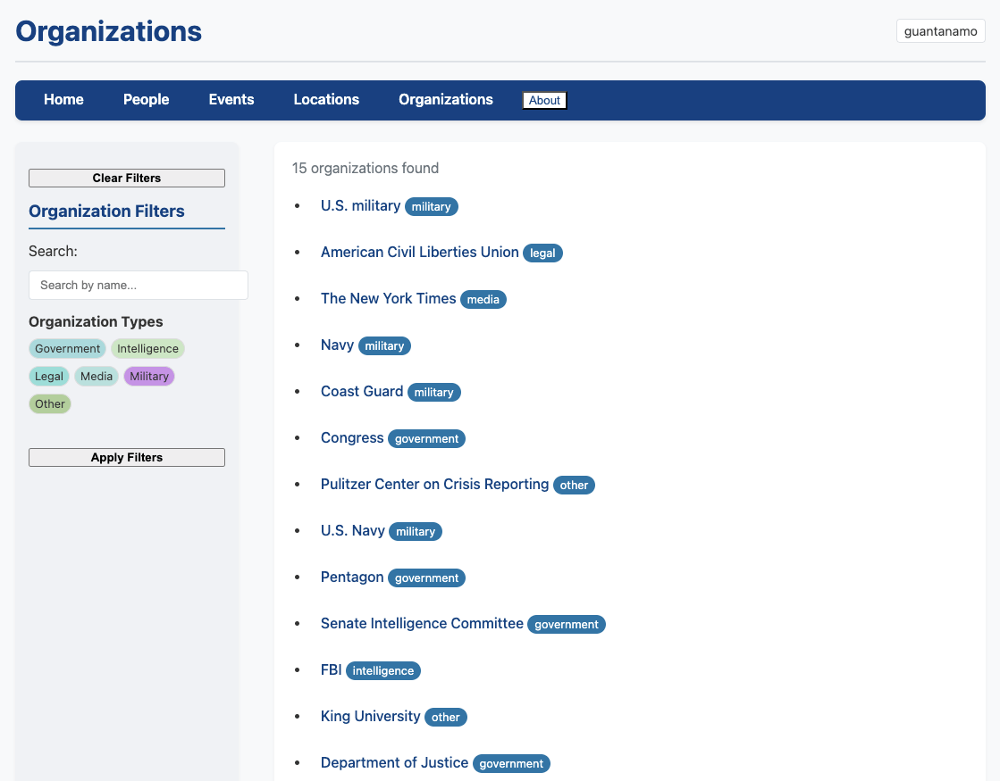
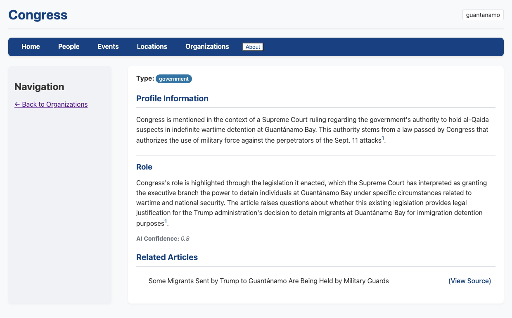

# hinbox

`hinbox` is a flexible, domain-configurable entity extraction system designed
for historians and researchers. It processes historical documents, academic
papers, news articles, and book chapters to extract structured information about
people, organizations, locations, and events. Originally designed for Guantánamo
Bay media coverage analysis, it now supports any historical or research domain
through a simple configuration system.

## 🎯 Key Features

- **Research-Focused**: Designed for historians, academics, and researchers
- **Flexible Sources**: Process historical documents, academic papers, news articles, book chapters
- **Domain-Agnostic**: Configure for any historical period, region, or research topic
- **Multiple AI Models**: Support for both cloud (Gemini default, but supports
  anything that `litellm` supports) and local (Ollama default, but works with
  `litellm`) models  
- **Entity Extraction**: Automatically extract people, organizations, locations, and events
- **Smart Deduplication**: RapidFuzz lexical blocking + embedding similarity with per-entity-type thresholds
- **Merge Dispute Agent**: Second-stage LLM arbitration for ambiguous gray-band entity matches
- **5-Layer Canonical Name Selection**: Deterministic scoring picks the best display name across aliases, penalizing acronyms and generic phrases
- **Profile Versioning**: Track how entity profiles evolve as new sources are processed
- **Profile Grounding**: Citation-backed claim verification checks that profile text is supported by source articles
- **Extraction Quality Controls**: Deterministic QC with automatic retry when severe issues (zero entities, high drop rates) are detected
- **Extraction Caching**: Persistent sidecar cache avoids redundant LLM calls when re-processing unchanged articles
- **Parallel Pipeline**: Concurrent article extraction with LLM rate limiting and batched embedding computation
- **Modular Engine**: `src/engine` coordinates article processing, extraction, merging, and profile versioning so new domains can reuse the same pipeline
- **Privacy Mode**: `--local` flag enforces local-only embeddings and disables all LLM telemetry callbacks
- **Web Interface**: FastHTML-based "Archival Elegance" UI with confidence badges, alias display, tag pills, and profile version navigation
- **Easy Setup**: Simple configuration files, no Python coding required

## 📸 Screenshots

<figure>
  
  <figcaption><em>Real-time processing logs showing entity extraction progress with detailed status updates</em></figcaption>
</figure>

<figure>
  
  <figcaption><em>Main dashboard displaying research domains and extracted entity statistics</em></figcaption>
</figure>

<figure>
  
  <figcaption><em>Organizations listing with search and filtering capabilities for research analysis</em></figcaption>
</figure>

<figure>
  
  <figcaption><em>Detailed organization profile showing extracted information, sources, and version history</em></figcaption>
</figure>

## 🚀 Quick Start

### 1. List Available Domains
```bash
just domains
```

### 2. Create a New Research Domain
```bash
just init palestine_food_history
```

### 3. Configure Your Research Domain
Edit the generated files in `configs/palestine_food_history/`:
- `config.yaml` - Research domain settings and data paths
- `prompts/*.md` - Extraction instructions tailored to your sources
- `categories/*.yaml` - Entity type definitions relevant to your research

### 4. Process Your Sources
```bash
just process-domain palestine_food_history --limit 5
```

### 5. Explore Results
```bash
just frontend
```

## 📦 Installation

### Prerequisites
- Python 3.12+
- `uv` (for dependency management)
- Optional: Ollama (for local model support)
- [`just`](https://just.systems/) (task runner)

### Setup

1. **Clone the repository:**
   ```bash
   git clone https://github.com/strickvl/hinbox.git
   cd hinbox
   ```

2. **Install dependencies:**
   ```bash
   # Cloud embeddings only (works on all platforms including Intel Mac):
   uv sync

   # With local embeddings (requires PyTorch — Linux/Apple Silicon/Windows):
   uv sync --extra local-embeddings
   ```

3. **Set up environment variables:**
   ```bash
   # Create a .env file (auto-loaded by just):
   echo 'GEMINI_API_KEY=your-gemini-api-key' > .env
   # Optional for local processing:
   echo 'OLLAMA_API_URL=http://localhost:11434/v1' >> .env
   ```

4. **Set up local model (optional, requires [Ollama](https://ollama.com)):**
   ```bash
   # Pull the default local model (Qwen 2.5 32B, ~23GB download):
   ollama pull qwen2.5:32b-instruct-q5_K_M

   # Set a realistic context window (Ollama defaults are modest;
   # Qwen 2.5 supports up to 131K tokens but more context = more VRAM).
   # Add to your shell profile or systemd unit for the Ollama server:
   export OLLAMA_CONTEXT_LENGTH=32768
   ```

   You can override the default models without editing code by setting
   environment variables in your `.env` file:
   ```bash
   # Override the local model (default: ollama/qwen2.5:32b-instruct-q5_K_M):
   echo 'HINBOX_OLLAMA_MODEL=ollama/gemma3:27b' >> .env

   # Override the cloud model (default: gemini/gemini-2.0-flash):
   echo 'HINBOX_CLOUD_MODEL=gemini/gemini-2.5-flash' >> .env
   ```

5. **Verify installation:**
   ```bash
   just domains
   ```

## 📚 Research Domain Examples

### History of Food in Palestine
```bash
just init palestine_food_history
# Edit configs/palestine_food_history/ to focus on:
# - People: farmers, traders, cookbook authors, anthropologists
# - Organizations: agricultural cooperatives, food companies, research institutions
# - Events: harvests, famines, recipe documentation, cultural exchanges
# - Locations: villages, markets, agricultural regions, refugee camps
```

### Soviet-Afghan War (1980s)
```bash
just init afghanistan_1980s
# Configure for:
# - People: military leaders, diplomats, journalists, mujahideen commanders
# - Organizations: military units, intelligence agencies, NGOs, tribal groups
# - Events: battles, negotiations, refugee movements, arms shipments
# - Locations: provinces, military bases, refugee camps, border crossings
```

### Medieval Trade Networks
```bash
just init medieval_trade
# Set up for:
# - People: merchants, rulers, scholars, travelers
# - Organizations: trading companies, guilds, monasteries, courts
# - Events: trade agreements, diplomatic missions, market fairs
# - Locations: trading posts, cities, trade routes, ports
```

## 🛠 Advanced Usage

### Processing Historical Sources
```bash
# Process with different options
just process --domain afghanistan_1980s --limit 20 --verbose
just process-domain palestine_food_history --limit 10 --relevance-check

# Use local models (requires Ollama) - useful for sensitive historical research
just process --domain medieval_trade --local

# Force reprocessing when you update your configuration
just process --domain afghanistan_1980s --force-reprocess
```

### Web Interface
```bash
just frontend
```
Explore extracted entities at http://localhost:5001

### Data Management
```bash
# Check processing status
just check

# Reset processing status
just reset

# View available domains
just domains

# Inspect trace runs/events (latest run by default)
just traces
just traces --domain guantanamo --list-runs
just traces --domain guantanamo --run-id <run_id> --stage merge.decision --tail 50
```

## 📂 Project Structure

```
configs/
├── guantanamo/        # Example domain shipped with the project
├── template/          # Starter files copied by `just init`
└── README.md          # Domain configuration walkthrough

src/
├── process_and_extract.py  # CLI entry point — parallel producer/consumer pipeline
├── engine/
│   ├── article_processor.py   # Relevance → extraction → QC retry orchestration
│   ├── extractors.py          # Unified cloud/local entity extraction
│   ├── mergers.py             # Lexical blocking → embedding similarity → match check → dispute
│   ├── match_checker.py       # LLM-based match verification
│   ├── merge_dispute_agent.py # Second-stage arbitration for gray-band matches
│   ├── profiles.py            # VersionedProfile history management
│   └── relevance.py           # Domain-specific relevance filtering
├── frontend/               # FastHTML "Archival Elegance" UI
│   ├── routes/             # Modular route handlers (home, people, orgs, locations, events)
│   ├── components.py       # Reusable UI building blocks (badges, version selectors, tags)
│   ├── data_access.py      # Centralised Parquet data loading
│   └── static/styles.css   # CSS variables, fonts, layout
├── utils/
│   ├── embeddings/         # EmbeddingManager, cloud/local providers, similarity helpers
│   ├── cache_utils.py      # Thread-safe LRU cache and stable hashing
│   ├── extraction_cache.py # Persistent sidecar cache for extraction results
│   ├── name_variants.py    # Deterministic name normalisation, acronym detection, canonical scoring
│   ├── processing_status.py # Sidecar JSON tracker (replaces in-Parquet status)
│   ├── outcomes.py         # PhaseOutcome structured result objects
│   └── quality_controls.py # Extraction QC, profile QC, and profile grounding verification
├── config_loader.py        # Domain config loader (incl. per-type thresholds, lexical blocking)
├── dynamic_models.py       # Domain-driven Pydantic model factories
├── constants.py            # Model defaults, embedding settings, thresholds, privacy controls
├── logging_config.py       # Rich-based structured logging with colour-coded decision lines
└── exceptions.py           # Custom exception types used across the pipeline

tests/
├── embeddings/                         # Embedding manager, cloud provider, config integration
├── test_canonical_name.py              # 5-layer canonical name scoring and rekey-on-merge
├── test_cli_privacy_mode.py            # --local flag enforces local embeddings
├── test_domain_paths.py                # Domain-specific path resolution and batch writes
├── test_entity_merger_merge_smoke.py   # Embedding-based merge smoke tests
├── test_entity_merger_similarity.py    # Similarity scoring, lexical blocking, fingerprints
├── test_extraction_cache.py            # Sidecar cache key determinism and roundtrip
├── test_extraction_retry.py            # QC-triggered retry logic and repair hints
├── test_llm_multiple_tool_calls.py     # Instructor multi-tool-call recovery
├── test_merge_dispute_agent_routing.py # Gray-band routing and dispute decisions
├── test_name_variants.py               # Name normalisation, acronyms, equivalence groups
├── test_profile_grounding.py           # Citation extraction and grounding verification
├── test_profile_versioning.py          # Versioned profile regression tests
└── test_frontend_versioning.py         # UI behaviour for profile history

data/
├── guantanamo/        # Default domain data directory (created locally)
└── {domain}/          # Additional domains maintain their own raw/entity data
```

## 🔧 Configuration

### Domain Configuration
Each domain has its own `configs/{domain}/` directory with:

**config.yaml** - Main settings:
```yaml
domain: "palestine_food_history"
description: "Historical analysis of Palestinian food culture and agriculture"
data_sources:
  default_path: "data/palestine_food_history/raw_sources/historical_sources.parquet"
output:
  directory: "data/palestine_food_history/entities"
```

**categories/*.yaml** - Entity type definitions:
```yaml
person_types:
  player:
    description: "Professional football players"
    examples: ["Lionel Messi", "Cristiano Ronaldo"]
```

**prompts/*.md** - Extraction instructions (plain English!):
```markdown
You are an expert at extracting people from historical documents about Palestinian food culture.
Focus on farmers, traders, cookbook authors, researchers, and community leaders...
```

### Data Format
Historical sources should be in Parquet format with columns:
- `title`: Document/article title
- `content`: Full text content  
- `url`: Source URL (if applicable)
- `published_date`: Publication/creation date
- `source_type`: "book_chapter", "journal_article", "news_article", "archival_document", etc.

## 🏗 Architecture

### Processing Pipeline
1. **Configuration Loading**: Read domain-specific settings
2. **Source Loading**: Process historical documents in Parquet format
3. **Relevance Filtering**: Domain-specific content filtering for research focus
4. **Parallel Extraction**: Concurrent article + entity-type extraction with LLM rate limiting (`ThreadPoolExecutor` workers, bounded semaphore for API calls)
5. **Extraction Caching**: Persistent sidecar cache keyed on content hash, model, prompt, and schema — skips redundant LLM calls on re-runs
6. **Quality Controls**: Deterministic QC validates extraction output (required fields, name normalisation, within-article dedup) with automatic retry on severe flags
7. **Smart Deduplication**: Lexical blocking pre-filter → batched embedding similarity → evidence-first merge cost structure (cheap checks before expensive LLM calls)
8. **Merge Dispute Resolution**: Gray-band matches (similarity near threshold with low confidence) get a second-stage LLM arbitration via `MergeDisputeAgent`
9. **Canonical Name Selection**: 5-layer scoring picks the best display name when entities merge, penalizing acronyms and generic phrases
10. **Profile Generation**: Create comprehensive entity profiles with citation-backed claims and automatic versioning
11. **Profile Grounding**: Post-processing verification that profile claims are supported by cited source articles
12. **Persistence**: Batched Parquet writes per entity type (avoiding write amplification), sidecar JSON for processing status

### Engine Modules
- `ArticleProcessor` orchestrates relevance checks, extraction dispatch (with QC retry), and per-article metadata aggregation (`src/engine/article_processor.py`)
- `EntityExtractor` unifies cloud and local model calls using domain-specific Pydantic schemas (`src/engine/extractors.py`)
- `EntityMerger` pre-filters with RapidFuzz lexical blocking, compares batched embeddings, calls match-checkers, routes gray-band cases to the dispute agent, and updates persisted Parquet rows (`src/engine/mergers.py`)
- `MergeDisputeAgent` provides second-stage structured LLM analysis for ambiguous merge/skip decisions (`src/engine/merge_dispute_agent.py`)
- `VersionedProfile` and helper functions maintain profile history for each entity (`src/engine/profiles.py`)

### Key Features
- **Domain-Agnostic**: Easy to configure for any topic
- **Multiple AI Models**: Cloud (Gemini) and local (Ollama) support
- **Privacy Mode**: `--local` flag forces local embeddings and disables all LLM telemetry
- **Smart Processing**: Automatic relevance filtering, caching, and multi-layer deduplication
- **Profile Versioning**: Track entity profile changes over time with full version history
- **Profile Grounding**: Citation-backed claim verification for generated profiles
- **Modern Interface**: FastHTML "Archival Elegance" theme with confidence badges, aliases, tag pills, and version navigation
- **Robust Pipeline**: Structured `PhaseOutcome` error handling, quality controls, extraction retry, and progress tracking
- **Structured Logging**: Colour-coded decision lines (`NEW`, `MERGE`, `SKIP`, `DISPUTE`, `DEFER`) for pipeline transparency

## Development

### Testing
```bash
# Run all tests
just test

# Run specific test files
just test -k test_profile_versioning
just test tests/test_entity_merger_similarity.py
```

CI runs lint and tests automatically on every PR (`.github/workflows/test.yml`). The test suite covers embedding similarity, lexical blocking, per-type threshold resolution, entity merger behavior, merge dispute agent routing, extraction caching, extraction retry logic, canonical name selection, name variant detection, profile grounding, profile versioning, privacy mode enforcement, and frontend components — all without requiring API keys or GPU.

### Code Quality
```bash
# Format code
just format

# Lint code
just lint

# Both together
just check-code

# Run exactly what CI runs (recommended before pushing)
just ci
```

## 🤝 Contributing

Contributions welcome! Areas of interest:
- New domain templates and examples
- Additional language model integrations
- Enhanced web interface features
- Performance optimizations

## 📄 License

MIT License - see [LICENSE](LICENSE) file for details.

## 🙋 Support

For questions about:
- **Configuration**: See `configs/README.md`
- **Setup**: Check installation steps above
- **Usage**: Try `just` or `just --list`
- **Issues**: Open a GitHub issue

---

**Built for**: Historians, researchers, and academics working with large document collections

**Built with**: Python, Pydantic, FastHTML, LiteLLM, Instructor, RapidFuzz, Jina Embeddings, Rich
